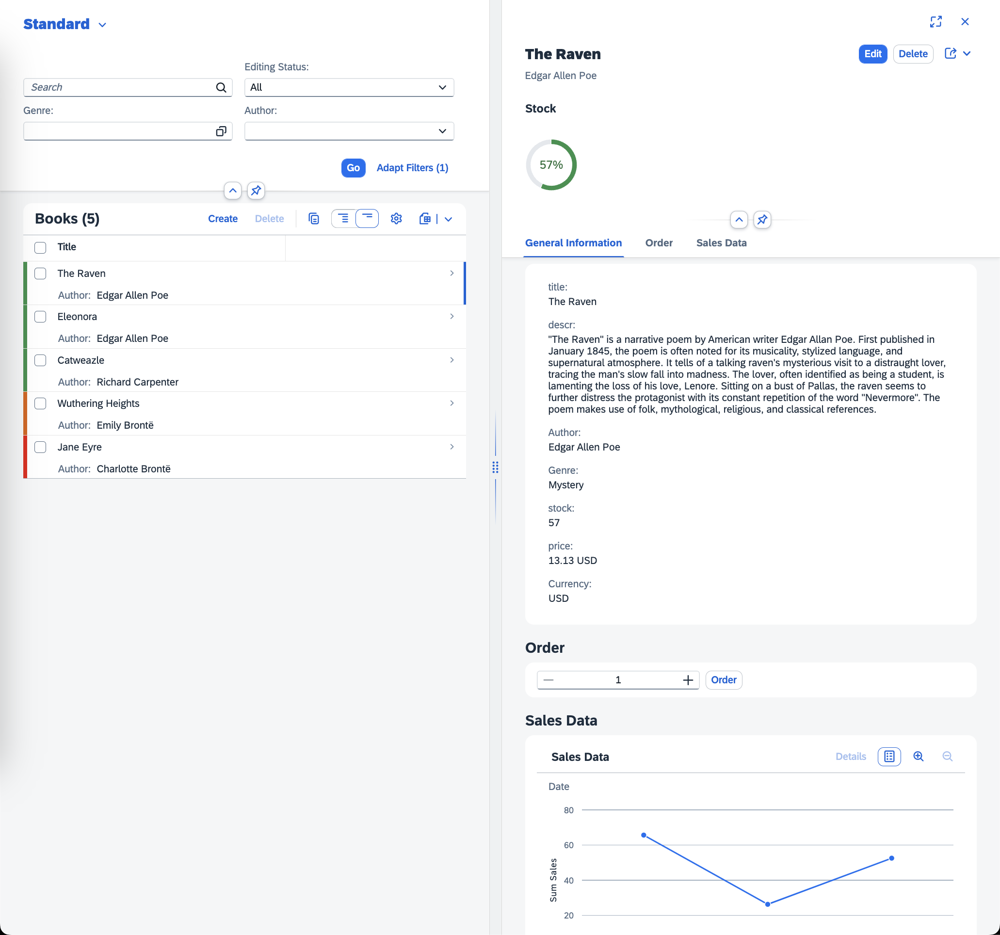

# SAP CodeJam - SAP Fiori elements flexible programming model

This repository contains material for SAP CodeJam events on the SAP Fiori elements flexible programming model.

Please check the [prerequisites](/chapters/00-prep-dev-environment/readme.md#1-prerequisites) before the event an make sure you meet them.

## Overview

The material in this repository introduces you to the [SAP Fiori elements](https://ui5.sap.com/#/topic/03265b0408e2432c9571d6b3feb6b1fd), more specifically its [flexible programming model](https://ui5.sap.com/test-resources/sap/fe/core/fpmExplorer/index.html#/overview/introduction). With SAP Fiori elements developers can create metadata-driven frontend applications that require little to no custom coding. This greatly improves the maintainability and UX consistency of these application, which are enterprise-ready out of the box. By selecting one of the available [floorplans](https://ui5.sap.com/#/topic/797c3239b2a9491fa137e4998fd76aa7.html) (think "application layouts"), developers can solely focus on the business logic. In addition to that, the SAP Fiori elements flexible programming model provides extension points to inject custom layouts and logic into the predefined floorplans. Therefore, the SAP Fiori elements flexible programming model bridges the gap between SAP Fiori elements and [freestyle UI5 development](https://github.com/SAP-Samples/ui5-exercises-codejam).

This repository is a step-by-step guide explaining how to build a bookshop application using the SAP Fiori elements flexible programming model. The finished application is a bookshop, where users can browse and order books. The OData backend service for this application was built using the Node.js flavour of SAP Cloud Application Programming Model (SAP CAP). It is a slighlty modified version of the well-know [bookshop example](https://github.com/SAP-samples/cloud-cap-samples/tree/main/bookshop). You can inspect it in the `bookshop/` directory.

After working through all the chapters, following the instruction, and reading the explanations, you will be able to develop your own applications using the SAP Fiori elements as well as its flexible programming model.

## Previous Knowledge

The material in this repository aims to be beginner friendly. While it certainly helps to have prior (web) development or even UI5 experience, beginners will still be able to follow along - even with no prior knowledge. In any case, make sure you read the instructions and explanations thoroughly to have the best learning experience possible.

## Material Organization

The material consists of a series of chapters, each in their own directory. The chapters build on top of each other and are meant to be completed in the given order. Each of the [chapters](#chapters) has its own 'readme' file with instructions, explanations, code samples, and screen shots. From a session flow perspective, we are taking a "coordinated" approach:

The instructor will set you off on the first chapter. Do not proceed to the next chapter until the instructor tells you to do so. If you finish a chapter before others, there are some questions at the end of each chapter for you to ponder.

> The exercises are written in a conversational way - this is so that they have enough context and information to be completed outside the hands-on session itself. To help you navigate and find what you have to actually do next, there are pointers like this ➡️ throughout that indicate the things you have to actually do (as opposed to just read for background information).

## Chapters

- [00 - Preparing the development environment](/chapters/00-prep-dev-environment/)
- [01 - Running the SAP CAP application](/chapters/01-run-cap-app/)
- [02 - Creating the SAP Fiori elements application](/chapters/02-create-fe-app/)
- [03 - Creating a custom section via an extension point](/chapters/03-custom-section-via-extension-point/)
- [04 - Using the JavaScript handler](/chapters/04-handler/)
- [05 - Adding a controller extension](/chapters/05-controller-extension/)
- [06 - Adding a building block](/chapters/06-building-block/)
- [07 - Adding formatting via CDS annotations](/chapters/07-formatting-via-cds-annotations/)
- [08 - Adding value help via CDS annotations](/chapters/08-value-help-via-cds-annotations/)
- [09 - Adding a header section via CDS annotations](/chapters/09-header-section-via-cds-annotations/)

## Support

Support for the content in this repository is available during SAP CodeJam events, for which this content has been designed. Otherwise, this content is provided "as-is" with no other support.

## Contributing
If you wish to contribute code, offer fixes or improvements, please send a pull request. Due to legal reasons, contributors will be asked to accept a DCO when they create the first pull request to this project. This happens in an automated fashion during the submission process. SAP uses [the standard DCO text of the Linux Foundation](https://developercertificate.org/).

## License
Copyright (c) 2024 SAP SE or an SAP affiliate company. All rights reserved. This project is licensed under the Apache Software License, version 2.0 except as noted otherwise in the [LICENSE](/LICENSE) file.
