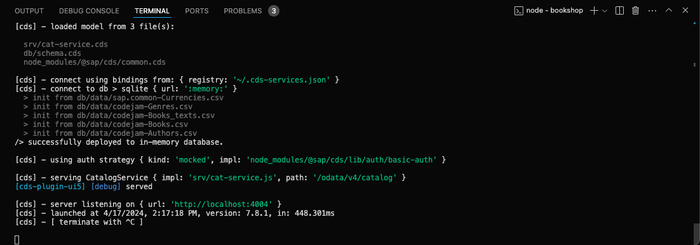
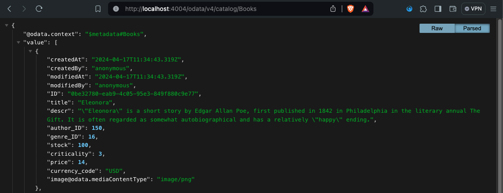

# Chapter 01 - Running the SAP CAP application

By the end of this chapter we will have inspected and ran our existing SAP CAP backend application.

## Steps

[0. Make sure you are in the project root (`bookshop/`)](#0-make-sure-you-are-in-the-project-root-bookshop)<br>
[1. Inspect the existing SAP CAP application](#1-inspect-the-existing-sap-cap-application)<br>
[2. Install the project dependencies](#2-install-the-project-dependencies)<br>

## 0. Make sure you are in the project root (`bookshop/`)

➡️ Make sure you are in the `bookshop/` directory, which is our project root.

The material in this repository will always reference directories and files in relation to this project root.

## 1. Inspect the existing SAP CAP application

Our project already contains quite a few directories and files, which give us a head start for developing our Fiori elements application. Our existing project contains an [SAP Cloud Application Programming Model](cap.cloud.sap) (SAP CAP) application that implements a bookshop backend service. It was built with the Node.js flavour of SAP CAP.

A little bit about the structure of our bookshop service (and SAP CAP applications in general):

- The [package.json](/bookshop/package.json) declares the Node.js application's dependencies and other metadata. This file is not specific to SAP CAP - all Node.js based applications need a `package.json`.
- The [db/](/bookshop/db/) directory represents the database layer of the backend, defining all entities (think "tables") as well as the association between them.
- The [srv/](/bookshop/srv/) directory represents the service layer of the backend, which is the API our frontend application will be interacting with.
- The [app/](/bookshop/app/) directory is empty (or non-existing) as of now. This is typically where frontend applications reside. We will create our SAP Fiori elements application in this directory as well.

## 2. Install the project dependencies

➡️ Run the following command from the `bookshop/` directory:

```bash
npm install
```

We installed the project dependencies declared in the `package.json` file, which generated a new `package-lock.json` file as well as a `node_modules/` directory, where the actual dependencies reside.

## 3. Run the SAP CAP application

➡️ Run the following command from the `bookshop/` directory:

```bash
npm run dev
```

By running the above command we executed the `dev` script defined in the `package.json` file. This script is `cds watch` - meaning that `npm run dev` works like an alias for `cds watch` in this case. `cds watch` is a command of the [`@sap/cds-dk`](https://www.npmjs.com/package/@sap/cds-dk) ("cds development kit") and starts our SAP CAP application in watch mode - meaning that it tracks file changes and restarts the server upon changes, which is very helpful during development.

The SAP CAP server is now running and accessible via a URL:



## 4. Test the bookshop service

➡️ Test the bookshop service by visiting the URL of the SAP CAP server. Click on any entity to view the raw data (pretty printed in this screen shot):



Continue to [Chapter 02 - Creating the SAP Fiori elements application](/chapters/02-create-fe-app/)
