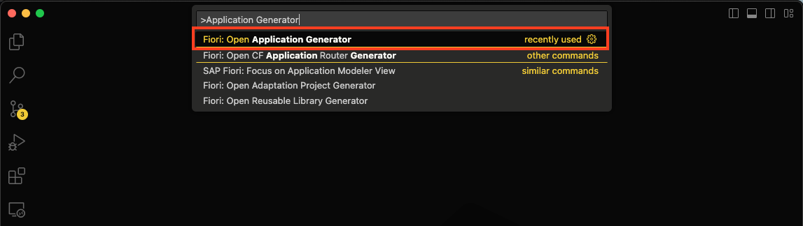
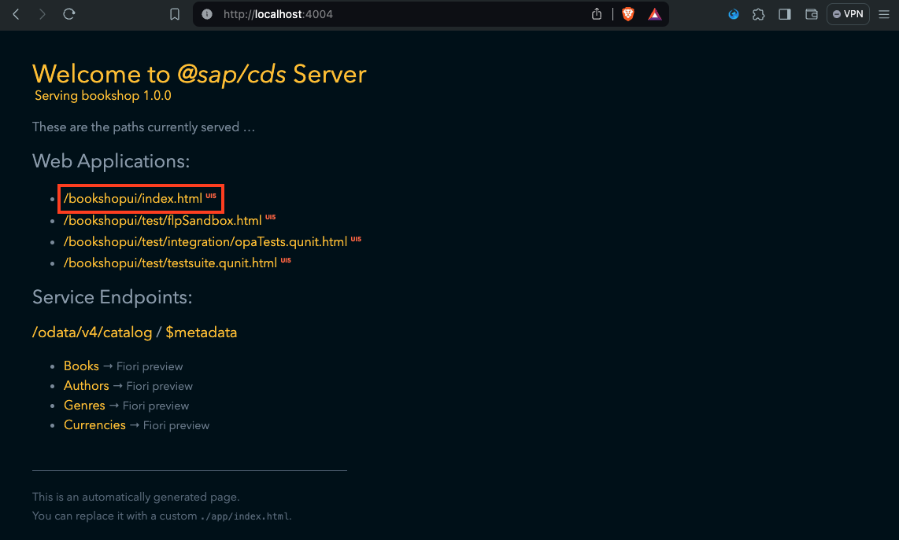
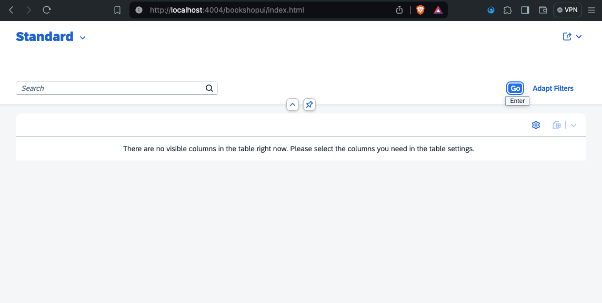

# Chapter 02 - Creating the SAP Fiori elements application

By the end of this chapter we will have created an SAP Fiori elements application that consumes our bookshop backend service.

## Steps

[1. Launch the SAP Fiori Tools Application Generator](#1-launch-the-sap-fiori-tools-application-generator)<br>
[2. Create an SAP Fiori elements application](#2-create-an-sap-fiori-elements-application)<br>
[3. Inspect the newly created application](#3-inspect-the-newly-created-application)<br>
[4. Start the SAP CAP server](#4-start-the-sap-cap-server)<br>
[5. Test the SAP Fiori elements application](#5-test-the-sap-fiori-elements-application)<br>
[6. Further questions to discuss](#6-further-questions-to-discuss)<br>

## 1. Launch the SAP Fiori Tools Application Generator

The [SAP Fiori Tools](https://marketplace.visualstudio.com/items?itemName=SAPSE.sap-ux-fiori-tools-extension-pack) is an extension pack for Visual Studio Code that bundles extensions that help with SAP Fiori development. We will use it extensively during this SAP CodeJam - starting with the creation of an SAP Fiori elements application. If you have not installed the SAP Fiori Tools yet, go back and work through [chapter 0](/chapters/00-prep-dev-environment/).

➡️ Open the command palette (Command/Ctrl + Shift + P), search for "Application Generator", and launch the SAP Fiori Tools Application Generator:



## 2. Create an SAP Fiori elements application

➡️ Create an application using the following settings and properties for the template wizard:

|||
| - | - |
| Template Type | SAP Fiori |
| Which template do you want to use? | List Report Page |
| Data source | Use a Local CAP Project |
| Choose your CAP project | bookshop |
| OData service | CatalogService (Node.js) |
| Main entity | Books |
| Navigation entity | None |
| Automatically add table columns to the list page and a section to the object page if none already exists? | Yes |
| Module name | bookshop-ui |
| Application title | Bookshop |
| Application namespace | *leave empty* |
| Description | A simple bookshop application. |
| Minimum SAPUI5 version | *choose latest* |
| Add deployment configuration to MTA project | No |
| Add FLP configuration | No |
| Configure advanced options | No

We created a new SAP Fiori elements application that consumes the bookshop backend service from our local SAP CAP application. We selected `Books` as the main entity. Let's now inspect this new application.

## 3. Inspect the newly created application

➡️ Open the `app/bookshop-ui/` directory and inspect its contents.

If you are familiar with UI5, you will recognize this project structure immediately (if you are not, check out this repository: [ui5-exercise-codejam](https://github.com/SAP-Samples/ui5-exercises-codejam)):
- The `webapp/` directory contains the actual web application - most importantly the `Component.js`, `index.html`, and `manifest.json`.
- The `app/bookshop-ui/` directory also contains its own `package.json`, which means it is a Node.js based application. It's a common practice to have nested Node.js applications during design time.
- The `app/bookshop-ui/` directory also contains a `ui5.yaml`, which allows us to configure the [UI5 Tooling](https://www.npmjs.com/package/@ui5/cli).

This project structure begs the question: What is the difference between a (freestyle) UI5 application and an SAP Fiori elements application?

> An SAP Fiori elements application is a certain kind of UI5 application that uses a predefined [floorplan](https://ui5.sap.com/#/topic/797c3239b2a9491fa137e4998fd76aa7.html) (think "application layout") - following a metadata-driven approach. Technically speaking, an SAP Fiori elements application uses the `sap/fe/core/AppComponent` from the SAPUI5 library. This means every SAP Fiori elements application is a UI5 application, but not vice versa. The opposite of an SAP Fiori elements application is a freestyle UI5 application, which implements its own custom layout (views) and application logic (controllers). The situation is not exactly black and white, however, as the [SAP Fiori elements flexible programming model](https://sapui5.hana.ondemand.com/test-resources/sap/fe/core/fpmExplorer/index.html#/overview/introduction) provides metadata-driven building blocks that can be used alongside freestyle UI5 coding. This set of exercises is dedicated to this powerful feature that combines the best of both worlds.

## 4. Start the SAP CAP server

➡️ (Re)start the SAP CAP server by running the following command from the `bookshop/` directory:

```bash
npm run dev
```

We (re)started the SAP CAP server - just like in the previous chapter. There is one small difference to note though: The logs now include the following:f
message, which indicates the SAP CAP server now also serves our frontend application with the help of the [`cds-plugin-ui5`](https://www.npmjs.com/package/cds-plugin-ui5):

```text
[cds-plugin-ui5] [info] Mounting /bookshopui to UI5 app ...
```

## 5. Test the SAP Fiori elements application

➡️ (Re)visit the URL of the SAP CAP server, refresh the page, and click on the link for the `/bookshopui/index.html` application:




We created a fully functional SAP Fiori elements application. Feel free to play around with the application - click "Go", then click one of the books in the table to navigate to its object page.

## 6. Further questions to discuss

➡️ If you happen to finish this chapter early, think about the following questions (that we will discuss later):

- Why was there no option in the template wizard to use OpenUI5 instead of SAPUI5?
- How does the SAP CAP server know it should serve the newly created SAP Fiori elements application?
- What is the benefit of using the [`cds-plugin-ui5`](https://www.npmjs.com/package/cds-plugin-ui5)?

Continue to [Chapter 03 - Creating a custom section via an extension point](/chapters/03-custom-section-via-extension-point/)
