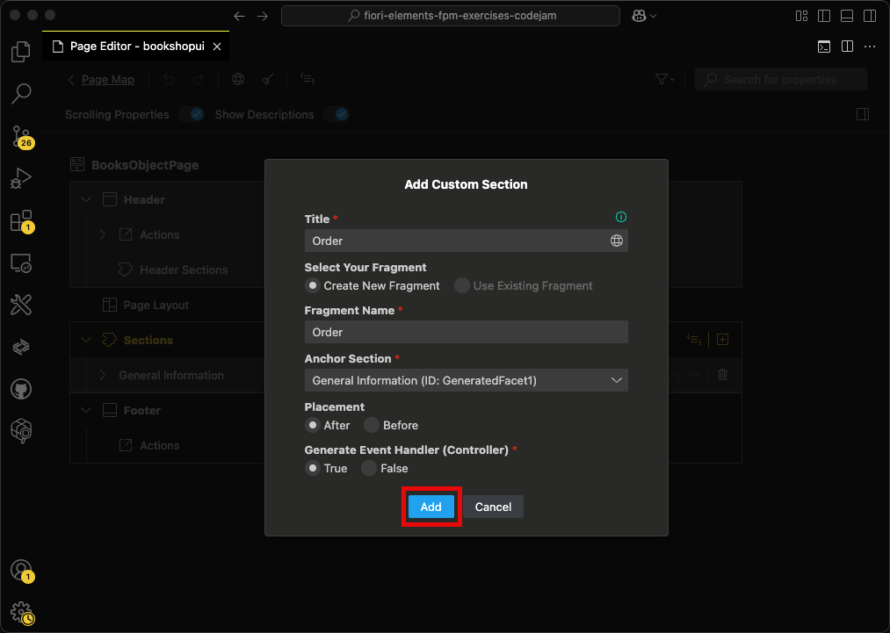

# Chapter 03 - Creating a custom section via an extension point

By the end of this chapter, we will have created a custom section in the SAP Fiori elements application using one of the available extension points.

## Steps

- [1. Launch the SAP Fiori Tools Page Map](#1-launch-the-sap-fiori-tools-page-map)<br>
- [2. Edit the object page](#2-edit-the-object-page)<br>
- [3. Create a new custom section](#3-create-a-new-custom-section)<br>
- [4. Enter properties for new custom section](#4-enter-properties-for-new-custom-section)<br>
- [5. Inspect the new custom section](#5-inspect-the-new-custom-section)<br>
- [6. Test the new custom section](#6-test-the-new-custom-section)<br>
- [7. Further questions to discuss](#7-further-questions-to-discuss)<br>

## 1. Launch the SAP Fiori Tools Page Map

For this chapter we use another one of the extension of the SAP Fiori Tools: the Page Map. The Page Map allows us to edit and visualize the pages of our application as well as their navigation flow.

➡️ Open the command palette (Command/Ctrl + Shift + P), search for "Page Map", and launch the SAP Fiori Tools Page Map:


## 2. Edit the object page

➡️ Click the pencil icon of the object page to edit it:


## 3. Create a new custom section

➡️ Click the plus icon in the "Sections" area of the Page Map to create a new custom section:


## 4. Enter properties for new custom section

➡️ Enter the following properties for the new custom section and click "Add":



We have created a new custom section using one of the available [extension points](https://sapui5.hana.ondemand.com/test-resources/sap/fe/core/fpmExplorer/index.html#/customElements/customElementsOverview) of the SAP Fiori elements flexible programming model. This custom section extension point allows us to have a walled playground for freestyle UI5 development within an SAP Fiori elements application. Let's inspect the generated artifacts.

## 5. Inspect the new custom section

➡️ Inspect the `app/bookshop-ui/webapp/ext/fragment` directory and its contents.

The SAP Fiori Tools generated this new directory that includes an XML fragment as well as the corresponding JavaScript handler. These files allow for custom coding of any sort. The custom section is loaded into the application via the `manifest.json`, where its metadata (like path, position, and title) is maintained. Take a moment to stare at this code, which is part of the `manifest.json`:

```json
"BooksObjectPage": {
    "type": "Component",
    "id": "BooksObjectPage",
    "name": "sap.fe.templates.ObjectPage",
    "options": {
        "settings": {
            "editableHeaderContent": false,
            "entitySet": "Books",
            "content": {
                "body": {
                    "sections": {
                            "Order": {
                            "template": "bookshopui.ext.fragment.Order",
                            "position": {
                                "placement": "After",
                                "anchor": "GeneratedFacet1"
                            },  
                            "title": "Order",
                            "type": "XMLFragment"
                        }
                    }
                }
            }
        }
    },
    "controlAggregation": "midColumnPages",
    "contextPattern": "/Books({key})"
}

```

## 6. Test the new custom section

➡️ (Re)visit the URL of the SAP CAP server and refresh the page. Click "Go", then click one of the books in the table to navigate to its object page and see the custom section:


## 7. Further questions to discuss

➡️ If you happen to finish this chapter early, think about the following questions (that we will discuss later):

- What other common use-cases are there for XML fragments, apart from custom sections?
- What is a `manifest.json`? Is this file specific to UI5?
- How do you personally like the experience using the SAP Fiori Tools so far? (There is no right or wrong answer to this question.)

Continue to [Chapter 04 - Using a JavaScript handler](/chapters/04-handler/)
