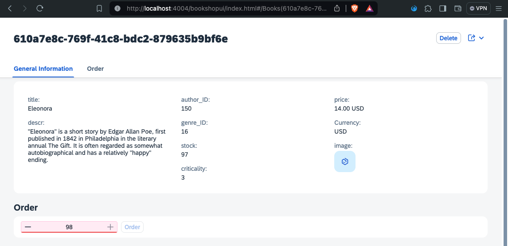

# Chapter 05 - Implementing a controller extension

By the end of this chapter, we will have implemented a controller extension that creates a new data model using a lifecycle hook provided by the SAP Fiori elements flexible programming model.

## Steps

- [1. Add the controller file](1#-add-the-controller-file)<br>
- [2. Register the controller file](2#-register-the-controller-file)<br>
- [3. Consume new data model in XML fragment](#3-consume-new-data-model-in-xml-fragment)<br>
- [4. Test new controller extension](#4-test-new-controller-extension)<br>
- [5. Further questions to discuss](#5-further-questions-to-discuss)<br>

## 1. Add the controller file

In addition to the simple JavaScript handlers (see [previous chapter](/chapters/04-handler/)), we can also equip our application with controller extensions, which allow to hook into certain lifecycle hooks provided by SAP Fiori elements.

➡️ Create a new file `app/bookshop-ui/webapp/ext/fragment/Order.controller.js` with the following content:

```javascript
sap.ui.define([
    "sap/ui/core/mvc/ControllerExtension",
    "sap/ui/model/json/JSONModel"
], function (ControllerExtension, JSONModel) {

    return ControllerExtension.extend("bookshopui.ext.fragment.Order", {
        override: {
            onInit: function() {
                this.getView().setModel(new JSONModel({ selectedQuantity: 1 }), "userInput")
            }
        }
    })

})
```

We added a controller extension that extends the `sap/ui/core/mvc/ControllerExtension` class and therefore has [access to the lifecycle hooks](https://ui5.sap.com/#/api/sap.ui.core.mvc.ControllerExtension%23methods/sap.ui.core.mvc.ControllerExtension.override) provided by SAP Fiori elements. This is particularly helpful if we want to inject logic before the page is rendered (`onInit` or `onBeforeRendering`), or if we want to make more global changes to our page, instead of just implementing logic for one single XML fragment via its handler (see [previous chapter](/chapters/04-handler/)). In our example, we overwrote the `onInit` lifecycle hook and created a new `JSONModel` called `userInput`. We will use this model to store the `selectedQuantity` of books by binding it to the value of the `<StepInput />` in our XML fragment. This model will be available to the whole page once we register the controller extension in the next step.

## 2. Register the controller file

To make sure our application loads our new controller extension, we have to register it.

➡️ Add the following code to the `sap.ui5` section in the `app/bookshop-ui/webapp/manifest.json`:

```json
"extends": {
    "extensions": {
        "sap.ui.controllerExtensions": {
            "sap.fe.templates.ObjectPage.ObjectPageController": {
                "controllerName": "bookshopui.ext.fragment.Order"
            }
        }
    }
}
```

We registered our controller extensions via the `sap.ui5.extends.extensions.sap.ui.controllerExtensions` object of the application's manifest. Our controller extension is specifically extending the `sap.fe.templates.ObjectPage.ObjectPageController` from the `fe` (SAP Fiori elements) library. The `controllerName` simply points to the path of our controller extension file.

You can read more about controller extensions in the [flexible programming model explorer](https://sapui5.hana.ondemand.com/test-resources/sap/fe/core/fpmExplorer/index.html#/controllerExtensions/guidanceControllerExtensions).

## 3. Consume new data model in XML fragment

Now that we have created the `userInput` data model during the `onInit` of the object page, we can bind it to our XML fragment.

➡️ Replace the `<StepInput />` and `<Button />` inside the `app/bookshop-ui/webapp/ext/fragment/Order.fragment.xml` file with the following code:

```xml
<StepInput 
    id="stepInput"
    min="1"
    max="{stock}"
    value="{userInput>/selectedQuantity}"
    textAlign="Center"
    validationMode="LiveChange" />

<Button
    id="orderButton"
    text="Order"
    press="handler.onSubmitOrder"
    enabled="{= %{stock} >= %{userInput>/selectedQuantity} ? true : false }"
    class="sapUiTinyMarginBegin" />
```

We used the data binding syntax (more specifically [context binding](https://sapui5.hana.ondemand.com/sdk/#/topic/91f05e8b6f4d1014b6dd926db0e91070)) to bind the `selectedQuantity` value of the `userInput` data model to the `<StepInput />`. Furthermore, we used [expression binding]() to enable and disable the `<Button />` based on whether this value is higher or lower than the available stock of the book. This is a good example of the power of data models and the [model-view-controller approach](https://sapui5.hana.ondemand.com/sdk/#/topic/91f233476f4d1014b6dd926db0e91070.html) in general. We can describe our application logic very declaratively, without having to worry about listening to value changes manually or updating the state of UI elements manually.

## 4. Test new controller extension

➡️ (Re)visit the URL of the SAP CAP server and refresh the page. Click "Go", then click on one of the books in the table to navigate to its object page. Enter a quantity higher than the stock and see how the order button gets disabled:



## 5. Further questions to discuss

➡️ If you happen to finish this chapter early, think about the following questions (that we will discuss later):

- Take a look at the controller extensions documentation in the [flexible programming model explorer](https://sapui5.hana.ondemand.com/test-resources/sap/fe/core/fpmExplorer/index.html#/controllerExtensions/controllerExtensionsOverview) - what other scenarios can you think of that could be implemented using controller extensions?
- We used expression binding to implement the order button's formatting - what other ways can you think of to do this?

Continue to [Chapter 06 - Adding a building block](/chapters/06-building-block/)
