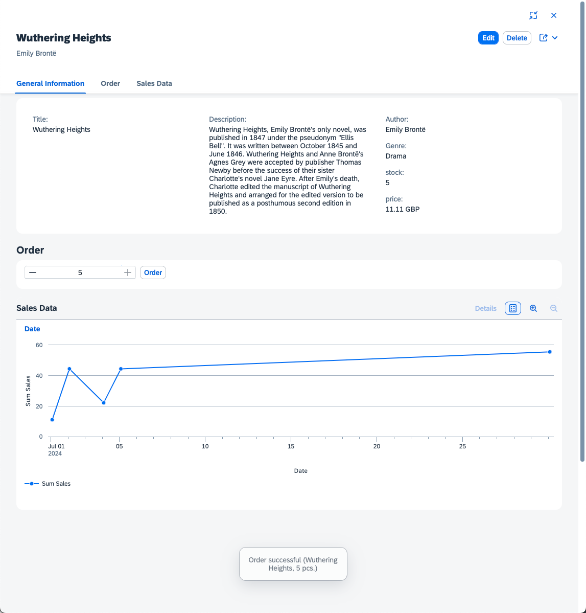

# Chapter 06 - Adding a building block

By the end of this chapter, we will have added a chart building block to the object page of our SAP Fiori elements application displaying sales data for the respective book.

## Steps

- [1. Define a new custom section](#1-define-a-new-custom-section)<br>
- [2. Create a new XML fragment](#2-create-a-new-xml-fragment)<br>
- [3. Add chart annotations](#3-add-chart-annotations)<br>
- [4. Test new chart building block](#4-test-new-chart-building-block)<br>
- [5. Further questions to discuss](#5-further-questions-to-discuss)<br>

## 1. Define a new custom section

➡️ In the `app/bookshop-ui/webapp/manifest.json` file, add the following code to the `sap.ui5.routing.targets.BooksObjectPage.options.settings.content.body.sections` section:

```json
,
"SalesData": {
    "template": "bookshopui.ext.fragment.SalesData",
	"position": {
		"placement": "After",
		"anchor": "Order"
	},
	"title": "Sales Data",
	"type": "XMLFragment"
}
```

This piece of code defines a new custom section in the form of an XML fragment. We will create this XML fragment in the next step. You might have noticed that it wasn't exactly easy to find the correct place to paste the code. Also, the syntax has to be very specific and might be hard to remember. The points of this step was really to highlight the value the SAP Fiori Tools and specifically its Page Map offer.

## 2. Create a new XML fragment

➡️ Create a new file `app/bookshopui/webapp/ext/fragment/SalesData.fragment.xml` and paste the following code:

```xml
<core:FragmentDefinition
	xmlns:core="sap.ui.core"
	xmlns="sap.m"
	xmlns:macros="sap.fe.macros">

	<macros:Chart
		id="salesChart"
		header="Sales Data"
		headerVisible="true"
		metaPath="@com.sap.vocabularies.UI.v1.Chart"
		contextPath="sales" />

</core:FragmentDefinition>
```

The XML fragment makes use of the chart building block (also called "macro") from the `sap.fe.macros` library. It specifies the `contextPath` as a relative path (no leading `/`) to `sales`. That means, the chart get its data from the `sales` property of the currently bound context of the object page, which is a single book. The `metaPath` of the building block points to a set of annotations, which we will create next. 

## 3. Add chart annotations

➡️ Add the following code to the `app/bookshopui/annotations.cds` file:

```cds
annotate CatalogService.Sales with @(

    UI.Chart                         : {
        $Type              : 'UI.ChartDefinitionType',
        ChartType          : #Line,
        DynamicMeasures    : ['@Analytics.AggregatedProperty#sum'],
        MeasureAttributes  : [{
            $Type         : 'UI.ChartMeasureAttributeType',
            DynamicMeasure: '@Analytics.AggregatedProperty#sum',
            Role          : #Axis1
        }],
        Dimensions         : [date],
        DimensionAttributes: [{
            $Type    : 'UI.ChartDimensionAttributeType',
            Dimension: date,
            Role     : #Category
        }]
    },

    Analytics.AggregatedProperty #sum: {
        Name                : 'sumSales',
        AggregationMethod   : 'sum',
        AggregatableProperty: 'price',
        ![@Common.Label]    : 'Sum Sales'
    },

    Aggregation.ApplySupported       : {
        Transformations         : [
            'aggregate',
            'topcount',
            'bottomcount',
            'identity',
            'concat',
            'groupby',
            'filter',
            'top',
            'skip',
            'orderby',
            'search'
        ],
        CustomAggregationMethods: ['Custom.concat'],
        Rollup                  : #None,
        PropertyRestrictions    : true,
        GroupableProperties     : [date],
        AggregatableProperties  : [{Property: price}]
    }

);
```

We added annotations for the `CatalogService.Sales` entity, for which we want to display a chart. First, the `UI.Chart` is defined as a `#Line` chart with one dimension and one measure. The dimension is `date` (time axis), and the measure is `Analytics.AggregatedProperty#sum`, which is a dynamic measure (meaning it is calculated on the fly). This dynamic measure is separately defined as the sum of the `price` property. Essentially, we want to display the daily sum of sales for a single book over time. To achieve that, the `CatalogService.Sales` entity also needs to be annotated with `Aggregation.ApplySupported`, which defines what type queries for grouping, sorting etc. are allowed for the entity. In our case, only the `date` property should be groupable, so that multiple sales on a single date can actually be added up to a sum.

## 4. Test new chart building block

➡️ (Re)visit the URL of the SAP CAP server and refresh the page. Click "Go", then click on one of the books in the table to navigate to its object page. Check out the "Sales Data" chart. Try ordering a few books and see how the data in the chart updates instantly.



## 5. Further questions to discuss

➡️ If you happen to finish this chapter early, think about the following questions (that we will discuss later):

- Which of the two ways of adding a custom section to an object page did you prefer? Using the SAP Fiori Tools Page Map or doing it manually? (There is no right or wrong to this answer.)
- What other use cases for [building blocks](https://sapui5.hana.ondemand.com/test-resources/sap/fe/core/fpmExplorer/index.html#/buildingBlocks/buildingBlockOverview) can you think of?
- How could we enable other chart types to be selectable in the chart itself (hint: search [this XML code](https://sapui5.hana.ondemand.com/test-resources/sap/fe/core/fpmExplorer/index.html#/buildingBlocks/chart/chartDefault) for the keyword "personalization")?

Continue to [Chapter 07 - Adding formatting via CDS annotations](/chapters/07-formatting-via-cds-annotations/)
