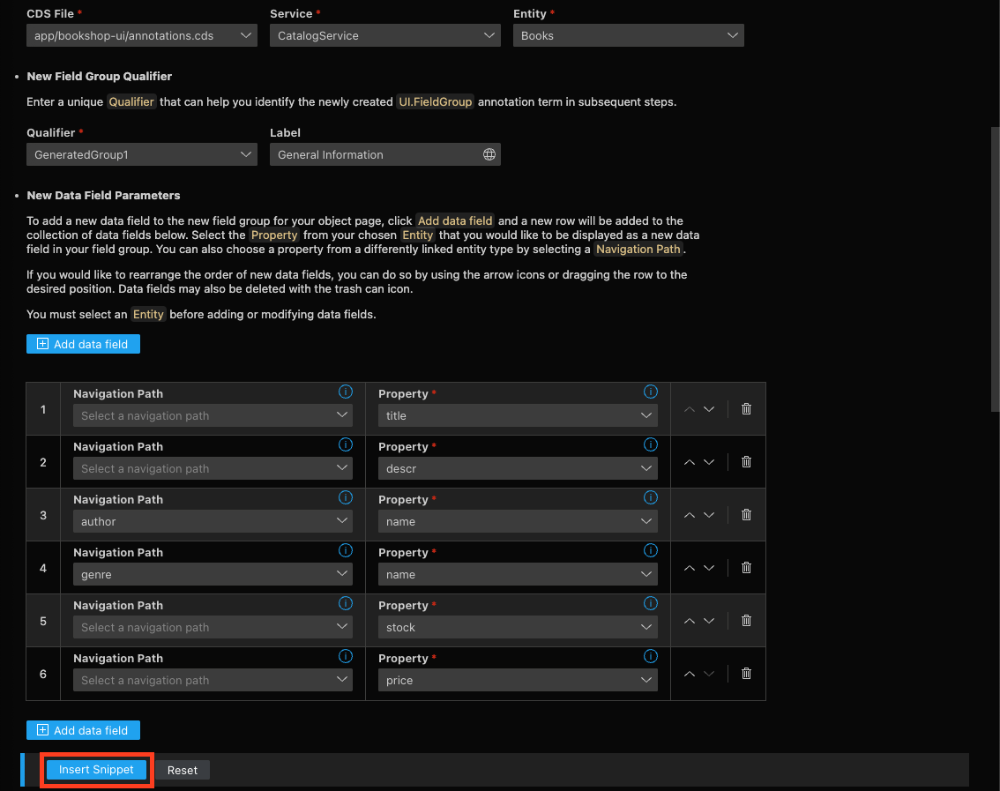
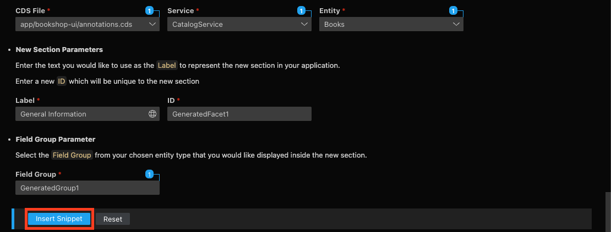
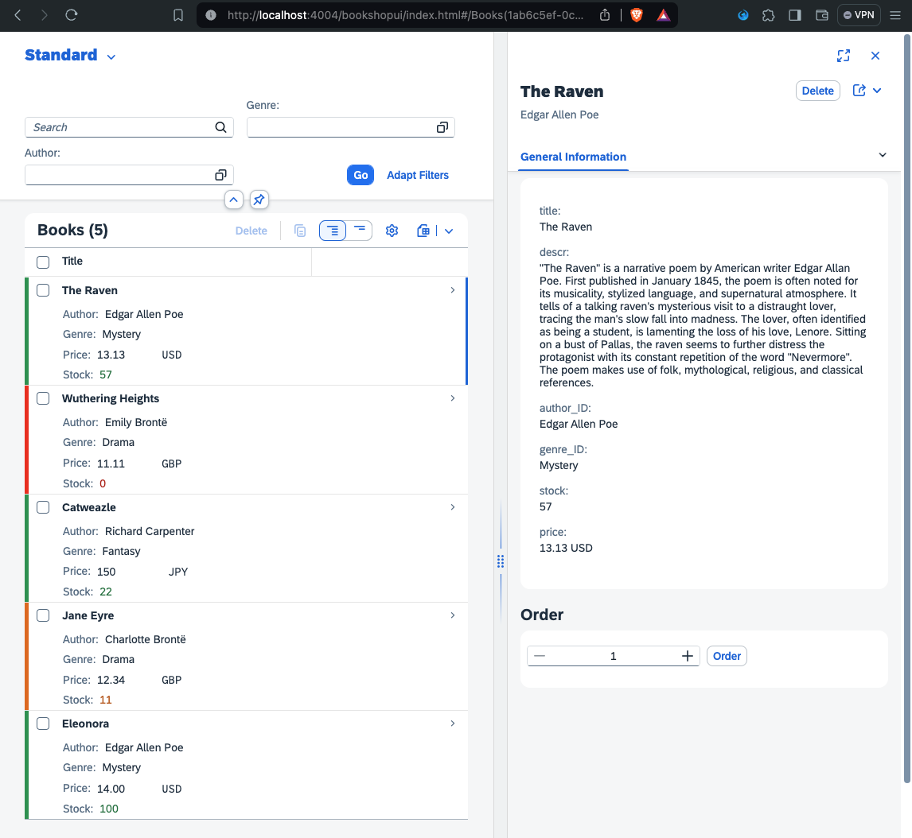

# Chapter 07 - Adding formatting via CDS annotations

By the end of this chapter, we will have added new formatting to our application via CDS annotations.

## Steps

- [1. Add CDS annotations for the list report page](#1-add-cds-annotations-for-the-list-report-page)<br>
- [2. Launch the SAP Fiori Tools Guided Development](#2-launch-the-sap-fiori-tools-guided-development)<br>
- [3. Add CDS annotations for the object page (1)](#3-add-cds-annotations-for-the-object-page-1)<br>
- [4. Add CDS annotations for the object page (2)](#4-add-cds-annotations-for-the-object-page-2)<br>
- [5. Test the new formatting](#5-test-the-new-formatting)<br>
- [6. Further questions to discuss](#6-further-questions-to-discuss)<br>

## 1. Add CDS annotations for the list report page

So far we have focused on the "flexible" part of the SAP Fiori elements programming model by developing a custom section and a controller extension. Now it's time to focus on the "SAP Fiori elements" part and its metadata-driven approach. With this approach, metadata about the backend OData service is interpreted by SAP Fiori elements, as this metadata contains annotations (think "instructions") on how to display its data in a user interface. Annotations can be maintained as part of the backend or be added as part of the SAP Fiori elements application, which is what we will do here.

Interestingly, there are already some annotations in the `app/bookshop-ui/annotations.cds` file, which where added semi-automatically (we said "yes" to that) by the SAP Fiori Tools Application Generator (see [chapter 2](/chapters/02-create-fe-app/)). For the sake of learning however, we will delete these annotations now and rebuild them step by step, so we understand how they work.

➡️ Replace the of `app/bookshop-ui/annotations.cds` file with the following code:

```cds
using CatalogService as service from '../../srv/cat-service';

// general
annotate CatalogService.Books with {
    title @title : 'Title';
    descr @title : 'Description';
    author @title: 'Author';
    genre @title: 'Genre';
    price @title: 'Price';
    stock @title: 'Stock';
};

annotate CatalogService.Books with @(
    UI: {
        SelectionFields: [ genre_ID, author_ID ],
        HeaderInfo: {
            TypeName      : 'Book',
            TypeNamePlural: 'Books',
            Title: { Value: title },
            Description: { Value: author.name }
        },
        Identification: [ { Value: ID } ],
        LineItem: {
            $value: [
                {
                    $Type: 'UI.DataField',
                    Value: title,
                    ![@UI.Importance] : #High
                },
                {
                    $Type: 'UI.DataField',
                    Value: author.name,
                    Label: 'Author',
                    ![@UI.Importance] : #High
                },
                {
                    $Type: 'UI.DataField',
                    Value: genre.name,
                    Label: 'Genre',
                    ![@UI.Importance] : #Medium
                },
                {
                    $Type: 'UI.DataField',
                    Value: price,
                    ![@UI.Importance] : #Medium
                },
                {
                    $Type: 'UI.DataField',
                    Value: stock,
                    Criticality : criticality,
                    CriticalityRepresentation : #WithoutIcon,
                    ![@UI.Importance] : #Medium
                } 
            ],
            ![@UI.Criticality] : criticality // criticality for whole line item
      }
    }
);

annotate CatalogService.Sales with @(

    UI.Chart                         : {
        $Type              : 'UI.ChartDefinitionType',
        ChartType          : #Line,
        DynamicMeasures    : ['@Analytics.AggregatedProperty#sum'],
        MeasureAttributes  : [{
            $Type         : 'UI.ChartMeasureAttributeType',
            DynamicMeasure: '@Analytics.AggregatedProperty#sum',
            Role          : #Axis1
        }],
        Dimensions         : [date],
        DimensionAttributes: [{
            $Type    : 'UI.ChartDimensionAttributeType',
            Dimension: date,
            Role     : #Category
        }]
    },

    Analytics.AggregatedProperty #sum: {
        Name                : 'sumSales',
        AggregationMethod   : 'sum',
        AggregatableProperty: 'price',
        ![@Common.Label]    : 'Sum Sales'
    },

    Aggregation.ApplySupported       : {
        Transformations         : [
            'aggregate',
            'topcount',
            'bottomcount',
            'identity',
            'concat',
            'groupby',
            'filter',
            'top',
            'skip',
            'orderby',
            'search'
        ],
        CustomAggregationMethods: ['Custom.concat'],
        Rollup                  : #None,
        PropertyRestrictions    : true,
        GroupableProperties     : [date],
        AggregatableProperties  : [{Property: price}]
    }

);
```

We manually added two main blocks of annotations for the `Books` entity of the bookshop service to our SAP Fiori elements application. The first code block contains simple labels for the fields of the entity. The second block contains annotations relevant for the list report page. Let's go through them one by one to make sure we really understand them:
- Using the [`UI` vocabulary](https://github.com/SAP/odata-vocabularies/blob/main/vocabularies/UI.md), we specify the filters (`UI.SelectionFields`) available on the list report page.
- The `UI.HeaderInfo` describes exactly that - information displayed in the header.
- The unique indentifier (`UI.Identification`) for the `Books` entity is the `ID`.
- The `UI.LineItem` annotations describe the columns of the table in the list report. Most interesting here are the `Criticality` of the `UI.DataField` for `stock`, which represents the color coding of the `stock` column. There is also a criticality set for the whole line item (think "row").

## 2. Launch the SAP Fiori Tools Guided Development

Annotations generally can become quite complex and files can get very large, which is why the SAP Fiori Tools can also help us with that aspect of SAP Fiori elements development. We will use the SAP Fiori Tools Guided Development to help us with the annotations for the object page.

➡️ Open the Command Palette (Command/Ctrl + Shift + P), search for "Guided Development", and launch the SAP Fiori Tools Guided Development. In the Guided Development window, search for the "Add a field group to an object page" guide and enter it:


 
## 3. Add CDS annotations for the object page (1)

➡️ Use the following settings and properties for **step 1** of the guide. For the data fields, click the "Add data field" button and add the following six data fields. Click "Insert Snippet" after entering all properties:



## 4. Add CDS annotations for the object page (2)

➡️ Use the following settings and properties for **step 2** of the guide. Click "Insert Snippet" after entering all properties:



## 5. Test the new formatting

➡️ (Re)visit the URL of the SAP CAP server and refresh the page. Inspect the new formatting on the list report page as well as the object page:



## 6. Further questions to discuss

➡️ If you happen to finish this chapter early, think about the following questions (that we will discuss later):

- In the screen shot in step 5 you can see the Flexible Column Layout in action. How can this be applied to the application using the SAP Fiori Tools? 
- How does SAP Fiori elements know how to color code the `stock` column in the list report? Where are the threshold values defined?

Continue to [Chapter 08 - Adding value help via CDS annotations](/chapters/08-value-help-via-cds-annotations)
