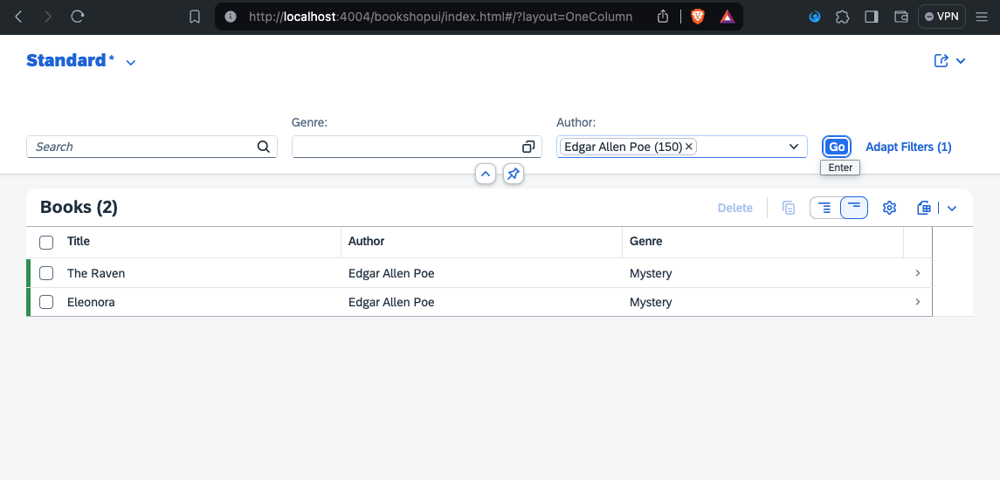
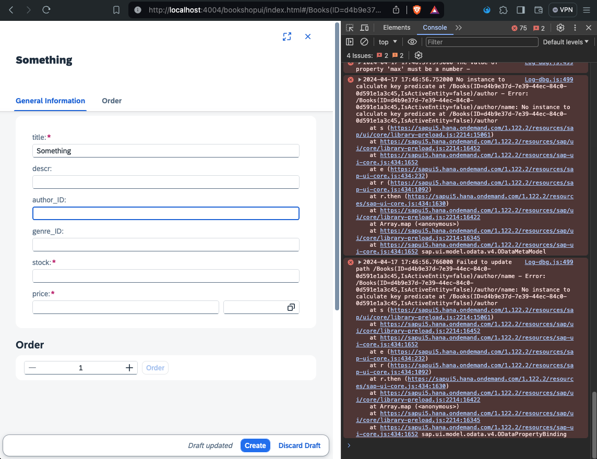
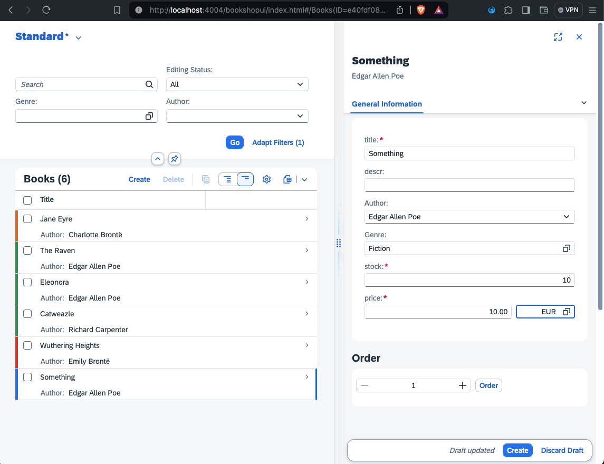

# Chapter 08 - Adding value help via CDS annotations

By the end of this chapter, we will have added value help to our application.

## Steps

- [1. Add CDS annotations for `Authors` value help](#1-add-cds-annotations-for-authors-value-help)<br>
- [2. Test value help on list report page](#2-test-value-help-on-list-report-page)<br>
- [3. Add CDS annotations for draft support](#3-add-cds-annotations-for-draft-support)<br>
- [4. Test value help on object page](#4-test-value-help-on-object-page)<br>
- [5. Modify existing CDS annotations for `UI.FieldGroup #GeneratedGroup1`](#5-modify-existing-cds-annotations-for-uifieldgroup-generatedgroup1)<br>
- [6. Add CDS annotations to display `name` instead of `ID`](#6-add-cds-annotations-to-display-name-instead-of-id)<br>
- [7. Test value help on object page (again)](#7-test-value-help-on-object-page-again)<br>
- [8. Further questions to discuss](#8-further-questions-to-discuss)<br>

## 1. Add CDS annotations for `Authors` value help

Similar to how we used CDS annotations to add certain formatting to our application (see [previous chapter](/chapters/07-formatting-via-cds-annotations)), we can use CDS annotations to add value help to filters and selection fields.

➡️ Add the following code to the `app/webapp/bookshop-ui/annotations.cds` file:

```cds
// value help for Authors
annotate CatalogService.Books with {
    author 
    @Common.ValueListWithFixedValues : true // dropdown instead of dialog
    @Common.ValueList : {
        $Type : 'Common.ValueListType',
        CollectionPath : 'Authors',
        Parameters : [
            {
                $Type : 'Common.ValueListParameterInOut',
                LocalDataProperty : author_ID,
                ValueListProperty : 'ID',
            }
        ]
    }
};

// value help for Authors: display name instead of ID
annotate CatalogService.Authors with {
    ID @Common.Text : {
        $value : name,
        ![@UI.TextArrangement] : #TextOnly,
    }
};
```

We added two blocks of CDS annotations to our application that serve two purposes:
1. The first block annotates the `author` of the `Books` entity. It makes sure that the value help is displayed as a dropdown menu (instead of a pop-up dialog) and that the `author_ID` does in fact point to the `ID` of the `Author` entity.
2. The second block then annotates the `Author` entity and makes sure that inside the value help the `name` is displayed instead of the `ID`.

## 2. Test value help on list report page

➡️ (Re)visit the URL of the SAP CAP server and refresh the page. Test the value help for `Authors` on the list report page:



## 3. Add CDS annotations for draft support

Before we can implement and test the value help on the object page as well, we have to make the `Books` entity editable via draft support.

The SAP Cloud Application Programming Model comes with built in support for drafts via the `@odata.draft.enabled` annotation. SAP Fiori elements applications will only display the CREATE and EDIT buttons for the respective entity if this annotation is set. With draft support in place, user sessions are stored on the server, so they can interrupt and continue later on, possibly from different places and devices.

➡️ Add the following code to the `app/bookshop-ui/annotations.cds` file:

```cds
annotate CatalogService.Books with @odata.draft.enabled;
```

We enabled draft support for the `Books` entity, which allows us to create new books and edit existing ones.

## 4. Test value help on object page

Let's test the draft support by creating a new book.

➡️ (Re)visit the URL of the SAP CAP server and refresh the page. Click "Create" on the list report page and enter some random data on the object page:



Whops! That is weird behavior. The application doesn't seem to save the `author_ID` or `genre_ID` values. The developer console of the browser reveals the error message, which looks something like this:

```text
Error: /Books(ID=<ID>,IsActiveEntity=false)/author/name: No instance to calculate key predicate at /Books(ID=<ID>,IsActiveEntity=false)/author
```

The error suggests that it is trying to find a key at `author/name` (as part of the `Books` entity), but the respective field for the association to authors is `author_ID`. Where did we make this mistake? It was in [step 3 of the previous chapter](/chapters/07-formatting-via-cds-annotations/#3-add-cds-annotations-for-the-object-page) when we selected the values for the "General Information" field group and specified it should display `genre.name` and `author.name`. While using these navigation paths (containing a `.`) works well for read operations, it doesn't work at all for create operations.

## 5. Modify existing CDS annotations for `UI.FieldGroup #GeneratedGroup1`

➡️ In the `app/bookshop-ui/annotations.cds` file, replace the annotations for the `Author` and `Genre` data fields within the `UI.FieldGroup #GeneratedGroup1` with the following code:

```cds
{
    $Type : 'UI.DataField',
    Label : 'Author',
    Value : author_ID,
},
{
    $Type : 'UI.DataField',
    Label : 'Genre',
    Value : genre_ID,
},
```

We modified the annotations so that the "General Information" field group now displays the `author_ID` and `genre_ID` instead of `author.name` and `genre.name`. While this fixes the value help (feel free to try it out), we now have a new problem: the object page of course now displays the `ID`s instead of `name`s, which is not very user friendly. Time to tackle this issue as well.

## 6. Add CDS annotations to display `name` instead of `ID`

➡️ In the `app/bookshop-ui/annotations.cds` file, replace the section labeled `general` (via a comment) with the following code:

```cds
// general
annotate CatalogService.Books with {
    title @title : 'Title';
    descr @title : 'Description';
    author @title: 'Author' @Common: { Text: author.name, TextArrangement: #TextOnly };
    genre @title: 'Genre' @Common: { Text: genre.name, TextArrangement: #TextOnly };
    price @title: 'Price';
    stock @title: 'Stock';
}
```

We modified the CDS annotations containing the titles for the fields of the `Books` entity. We added details about the text that should be displayed for certain fields, namely the `author.name` for authors and `genre.name` for genres.   

## 7. Test value help on object page (again)

➡️ (Re)visit the URL of the SAP CAP server and refresh the page. On the list report page, click "Create" and test the value help on the object page. You should see the `name`s for author and genre (instead of `ID`s) and you should be able to create the book:



### 8. Further questions to discuss

➡️ If you happen to finish this chapter early, think about the following questions (that we will discuss later):

- In step 6 we added annotations that make sure the `name`s are displayed for the author and genre. We did something similar in step 1 as well - what is the difference?
- How do you personally like the experience using annotations so far? (There is no right or wrong answer to this question.)

Continue to [Chapter 09 - Adding a header section via CDS annotations](/chapters/09-header-section-via-cds-annotations/)
