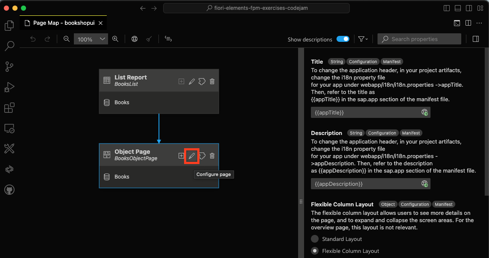
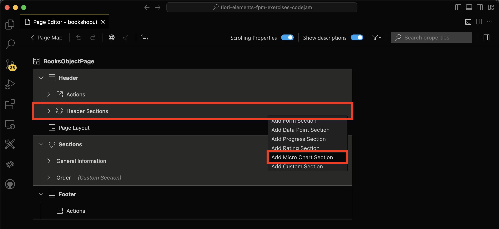
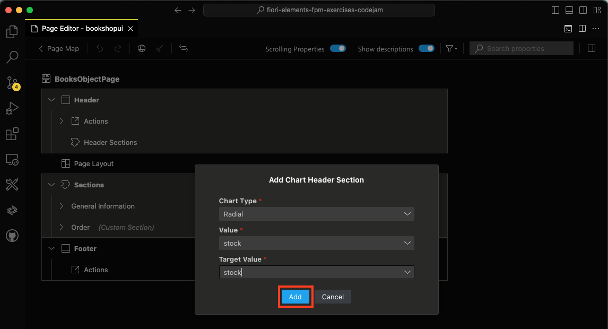
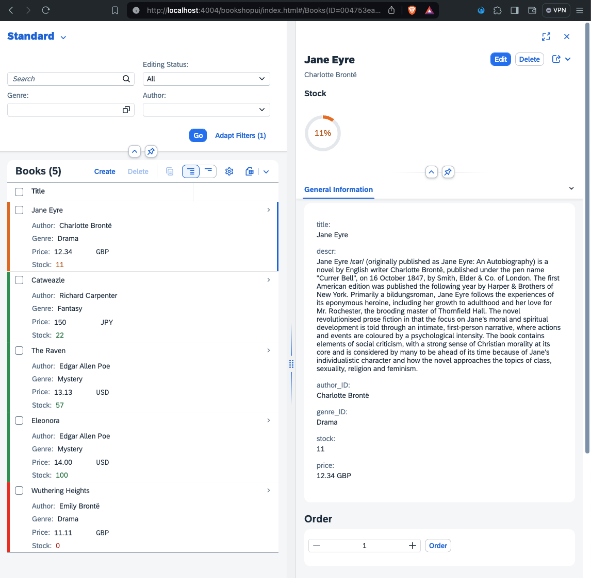

# Chapter 09 - Adding a header section via CDS annotations

By the end of this chapter we will have added a micro chart header section to the object page.

## Steps

- [1. Launch the SAP Fiori Tools Page Map](#1-launch-the-sap-fiori-tools-page-map)<br>
- [2. Edit the object page](#2-edit-the-object-page)<br>
- [3. Create a new micro chart header section](#3-create-a-new-micro-chart-header-section)<br>
- [4. Enter properties for new header section](4#-enter-properties-for-new-header-section)<br>
- [5. Inspect generated CDS annotations](#5-inspect-generated-cds-annotations)<br>
- [6. Modify genereated CDS annotations](#6-modify-generated-cds-annotations)<br>
- [7. Test the new header section](#6-test-the-new-header-section)<br>
- [8. Further questions to discuss](#8-further-questions-to-dicuss)<br>

## 1. Launch the SAP Fiori Tools Page Map

For this chapter we use Fiori Tools Page Map and Guided Development again.

➡️ Open the command palette (Command/Ctrl + Shift + P), search for "Page Map", and launch the SAP Fiori Tools Page Map:


## 2. Edit the object page

➡️ Click the pencil icon of the object page to edit it:



## 3. Create a new micro chart header section

➡️ Click the plus icon in the "Header > Header Sections" area of the Page Map to create new micro chart section:



## 4. Enter properties for new header section

➡️ Enter the following properties for the new micro chart header section and click "Add":



We created a new radial chart inside a new header section in our object page. But what exactly did the SAP Fiori Tools do behind the scenes? Let's inspect the generated CDS annotations.

## 5. Inspect generated CDS annotations

➡️ Open the `app/bookshop-ui/annotations.cds` file and inspect the newly added code (most likely at the end of the file):

```cds
annotate CatalogService.Books with @(
    UI.DataPoint #stock : {
        Value : stock,
        TargetValue : stock,
    },
    UI.Chart #stock : {
        ChartType : #Donut,
        Title : 'Stock',
        Measures : [
            stock,
        ],
        MeasureAttributes : [
            {
                DataPoint : '@UI.DataPoint#stock',
                Role : #Axis1,
                Measure : stock,
            },
        ],
    },
    UI.HeaderFacets : [
        {
            $Type : 'UI.ReferenceFacet',
            ID : 'stock',
            Target : '@UI.Chart#stock',
        },
    ]
);
```

The SAP Fiori Tools added a new block of CDS annotations. Let's go through the code step by step.
- First, a new `UI.DataPoint` named `#stock` is defined. The `Value` as well as `TargetValue` for this data point is `stock`. This does not make a lot of sense, but we will manually adjust the `TargetValue` in the next step.
- The `#stock` data point is consumend by the newly created `UI.Chart` (also named `#stock`).
- The `#stock` chart in turn is added to the `UI.HeaderFacets`, which represent the header content of the object page.

## 6. Modify generated CDS annotations

As already mentioned, the generated CDS annotations, more specifically the `UI.DataPoint #stock`, offer some room for improvement. Currently, the `Value` and `TargetValue` are both set to `stock`, which results in the donut chart always displaying "100%". Let's fix this.

➡️ Replace the annotation for the `UI.DataPoint #stock` with the following code:

```cds
UI.DataPoint #stock : {
    Value : stock,
    TargetValue : 100,
    Criticality : criticality
},
```

We hard-coded a `TargetValue` of `100` for the data point and also added the `Criticality` annotation to add color coding to the donut chart. For that, we use the `criticality` field we have already used in previous chapters. 

## 7. Test the new header section

➡️ (Re)visit the URL of the SAP CAP server and refresh the page. Click "Go", then click on one of the books in the table to navigate to its object page. Inspect the donut chart in the object page header:



## 8. Further questions to discuss

- How did you like this SAP CodeJam?
- Why are you still here? Enjoy your ["Feierabend"](https://expath.com/knowledge-base/germany/what-does-feierabend-mean)!
